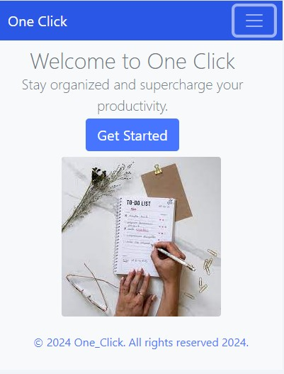
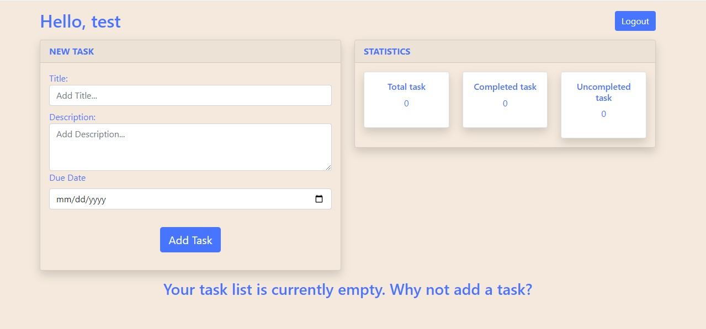

# Webstack---Portfolio-Project---One_Click

## Introduction

The One Click is a web-based application designed to streamline task management and productivity tracking for individuals or teams. With a simple and intuitive user interface, users can easily create, manage, and track tasks for the week and month, all with just one click. The platform allows users to add tasks with titles and descriptions, set priorities and due dates, and mark tasks as completed as they progress. Additionally, the project includes features for calculating the percentage of completed tasks, providing users with insights into their productivity and progress.
The aim of the "One Click" is to simplify task management and enhance productivity by offering a user-friendly solution for organizing and tracking tasks effectively.You can connect with me on [LinkedIn](https://www.linkedin.com/in/fatima-amkachou-7a0a53278/).

[Go To One Click](http://ftfati.pythonanywhere.com/)

## Features
- <b>User Authentication:</b> Users can create an account, log in, and log out securely.
- <b>Task Management:</b> Users can create tasks with titles, descriptions, and due dates.
- <b>Edit Task:</b> Users can edit their tasks.
- <b>Delete Task:</b> Users can delete their tasks.
- <b>Task Status:</b> Users can mark tasks as complete or incomplete.
- <b>Password Reset:</b> Users can request a password reset if they forget their password.

### Installation

- Clone the repository:
  `git clone https://github.com/FTFati/Webstack---Portfolio-Project---One_Click.git`

- Navigate to the project directory:
  `cd Webstack---Portfolio-Project---One_Click`

### Usage

- Start the development server:
  `python3 app.py`
- Open your web browser and go to `http://localhost:5000`.
- Register for a new account or log in if you already have an account.
- Once logged in, you will be directed to the dashboard where you can manage your tasks.
- Create new tasks, mark tasks as complete, edit task details, or delete tasks as needed.
- Log out when you are done using the application
## Technologies Used

### Frontend Frameworks and Libraries:
- [Bootstrap](https://getbootstrap.com/): Frontend framework for developing responsive and mobile-first websites.

### Backend Frameworks and Libraries:
- [Flask](https://flask.palletsprojects.com/): Lightweight Python web framework for building web applications.
- [Flask-Bcrypt](https://flask-bcrypt.readthedocs.io/en/latest/): Flask extension for hashing passwords.
- [Flask-Login](https://flask-login.readthedocs.io/en/latest/): Flask extension for managing user authentication.
- [Flask-Mail](https://pythonhosted.org/Flask-Mail/): Flask extension for sending email messages.
- [Flask-SQLAlchemy](https://flask-sqlalchemy.palletsprojects.com/): Flask extension for working with SQL databases using SQLAlchemy.

### Other Technologies:
- [SQLite](https://www.sqlite.org/index.html): Lightweight, serverless database engine used for storing application data.
- [Python](https://www.python.org/): Programming language used for backend development.
- [HTML](https://developer.mozilla.org/en-US/docs/Web/HTML): Markup language for creating web pages.
- [CSS](https://developer.mozilla.org/en-US/docs/Web/CSS): Style sheet language for styling web pages.
- [JavaScript](https://developer.mozilla.org/en-US/docs/Web/JavaScript): Programming language for enhancing interactivity in web applications.

### Running the Application

- Start the development server:
- Access the application at `http://localhost:5000` by default.

## Authors
[Fatima Amkachou](https://github.com/FTFati): Full Stack Developer, Project Manager
